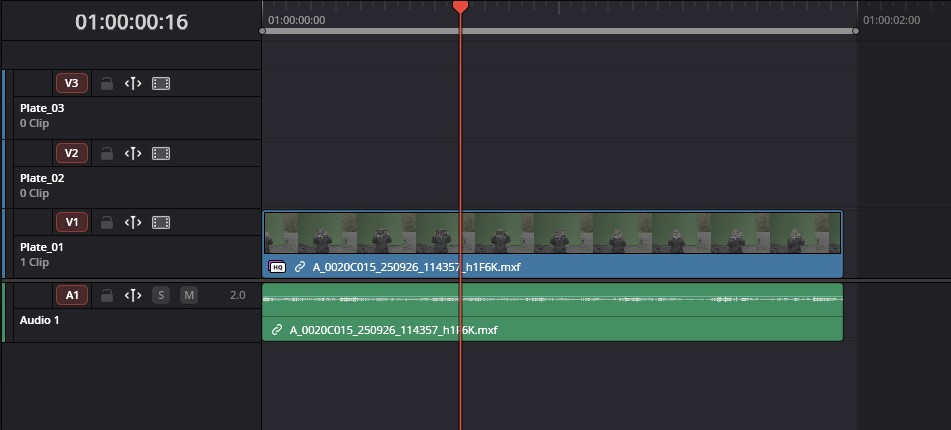
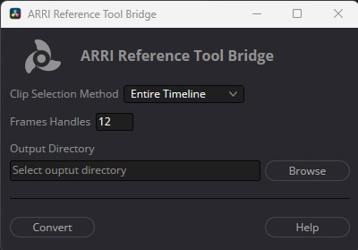

# ARRI Reference Tool Bridge Documentation

 

This is the official ARRI Reference Tool Bridge for DaVinciResolve Studio.  
The goal of this tool is to automate the EXR export of ARRI RAW & ARRI RAW (HDE) clips on a DaVinci Resolve timeline, by using the ARRI Reference Tool standalone software.  
The output are **EXR files sequence, uncompressed, 16-bits and with metadata per frame**.  

Through this documentation, you will learn how to use the ARRI Reference Tool Bridge tool and how to install it. 

## Table of Contents

[Installation](#installation)  
[Using the Tool](#using-the-tool)  
[Incoming Features](#incoming-features) 
[Uninstallation](#uninstallation)  
[Known Bugs & Issues](#known-bugs--issues)  

## Installation

### Prerequisites

 To use properly ARRI Reference Tool Bridge for DaVinciResolve, you must have : 

- DaVinciResolve Studio Version 20.2 or later
- ARRI Reference Tool CMD v0.4.1 or later
- Python v3.10 or later

The ARRI Reference Tool CMD v0.4.1 must be installed inside your `C:/Program Files/ARRI/ARRIReferenceTool_cmd/` directory. If it's not the case, create the folder and put the content of the ZIP file from [ARRI Reference Tool](https://www.arri.com/en/learn-help/learn-help-camera-system/tools/arri-reference-tool) website. 

Python v3.10 should be installed in your `C:/Program Files/Python/` directory. You can install Python directly from the official [Python](https://www.python.org/downloads/windows/) website.

### ⚠️ Attention : Only DaVinciResolve Studio version (paid version) is compatible with the ARRI Reference Tool Bridge.   

Otherwise, the workflow integration plugin won't be recognized by DaVinci Resolve.

---

### Installing ARRI Reference Tool Bridge

Follow those steps to install ARRI Reference Tool Bridge for DaVinciResolve Studio :

1. Go to the directory : `C:\Program Data\Blackmagic Design\DaVinci Resolve\Support`.
   
   > If you can't see the folder `Program Data` in your `C:\` drive, check those options :
   >
   > - **On Windows**
   >    
   >    1. In Windows explorer, click on the **View**  button.
   >
   >    2. Then go to **Show > Hidden items**
   >
   >       

2. Inside the directory, create a folder called `Workflow Integration Plugins`.
3. Paste the `arriRefToolBridge.py` file and the `arriRefToolBridge` folder inside the `Workflow Integration Plugins` folder.
4. Restart DaVinci Resolve if it was already opened.

## Using the tool

### Prerequisites

Before running the tool, you must have a DaVinci Resolve **project** opened and a **timeline** opened.  

> Creating a new timeline for the ARRI Reference tool is advised. You can duplicate your editing timeline by :  
> `Right Click on timeline > Duplicate timeline`

On your timeline, you must have at least **three video tracks, exactly named** `Plate_01, Plate_02, Plate_03` *(cf. see below)* with all your editing inside.

  

### ⚠️ Attention : Remove every effect and transition from your timeline before running the tool.

ℹ️ For your information, the tool detects only the ARRI RAW & ARRI RAW (HDE) footage.

### Launching the tool

Then, click on `Workspace > Workflow Integration Plugins > arriRefToolBridge`  

This window should pop-up :  

The ARRI Reference Tool Bridge has **3 options** :

- **Clip Selection Method** : You can choose between two settings :
  
  - **Entire Timeline**, the tool will treat all the clips found in the timeline and convert them to the image sequence.
  - **In and Out Markers**, the tool will treat all the clips found in the In/Out range, defined by **your In and Out markers** on your timeline. 
- **Frames Handles** : The tool will export the number of additional frame at the **start** and at the **end** of each clip.
- **Output Directory** : The output folder for all your converted clips. The tool will create a sub-folder for each found clips. The name of the subfolder is base on the clip original name **plus a suffix of three digits number.**

When you are satisfied with your settings, you can run the tool by pressing the button **Convert**.

ℹ️ **The conversion can take a very long time, launching the tool before quiting school or on friday evening is advised.**

When the conversion is done, you can replace in your editing timeline your video clips by your EXR sequence. To automatically replace clips, check this documentation.

## Incoming features

- Progress bar to view the current progress of the conversion
- Cancel button during conversion
- Error and Warning pop-up windows when modifying settings
- Job finished window when the conversion is finished

## Uninstallation

To remove the tool, you just have to delete  `arriRefToolBridge.py` file and the `arriRefToolBridge` folder from the `Workflow Integration Plugins` folder.

## Known Bugs & Issues

- This section is currently empty. Don't hesitate to give feedbacks and report bugs.