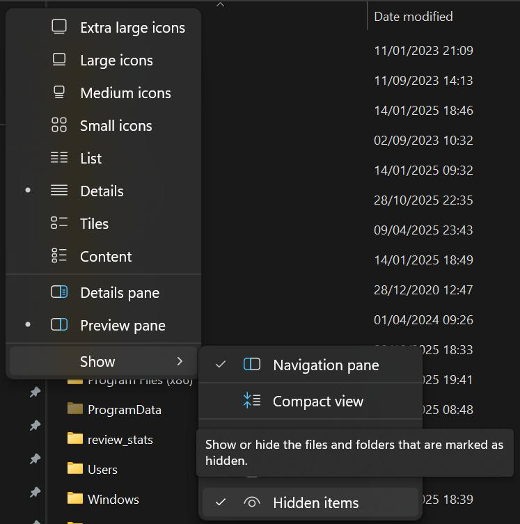

# ARRI Reference Tool Bridge Documentation

 This is the official ARRI Reference Tool Bridge for DaVinciResolve Studio  
Through this documentation, you will learn how to use the ARRI Reference Tool Bridge tool, its use cases and how to install it. 

## Table of Contents

[Installation](#installation)  
[Using the Tool](#using-the-tool)  
[Uninstallation](#uninstallation)  

## Installation

### Prerequisites

 To use properly ARRI Reference Tool Bridge for DaVinciResolve, you must have : 

- DaVinciResolve Studio Version 20.2 or later
- ARRI Reference Tool CMD v0.4.1 or later
- Python v3.10 or later

The ARRI Reference Tool CMD v0.4.1 must be installed inside your `C:/Program Files/ARRI/ARRIReferenceTool_cmd/` directory. If it's not the case, create the folder and put the content of the ZIP file from [ARRI Reference Tool](https://www.arri.com/en/learn-help/learn-help-camera-system/tools/arri-reference-tool) website. 

Python v3.10 should be installed in your `C:/Program Files/Python/` directory. You can install Python directly from the official [Python](https://www.python.org/downloads/windows/) website.

### ⚠️ Attention : Only DaVinciResolve Studio version (paid version) is compatible with the ARRI Reference Tool Bridge.   Otherwise, the workflow integration plugin won't be recognized by DaVinci Resolve.

---

### Installing ARRI Reference Tool Bridge

Follow those steps to install ARRI Reference Tool Bridge for DaVinciResolve Studio :

1. Go to the directory : `C:\Program Data\Blackmagic Design\DaVinci Resolve\Support`.
   
   > If you can't see the folder `Program Data` in your `C:\` drive, check those options :
   >
   > - **On Windows**
   >    
   >    1. In Windows explorer, click on the **View**  button.
   >
   >    2. Then go to **Show > Hidden items**
   >
   >       

2. Inside the directory, create a folder called `Workflow Integration Plugins`.
3. Paste the `arriRefToolBridge.py` file and the `assets` folder inside the `Workflow Integration Plugins` folder.
4. Restart DaVinciResolve if it was already opened.

## Using the tool

Before running the tool, you must have a DaVinci Resolve **project** opened and a **timeline** opened.  
Then, click on `Workspace > Workflow Integration Plugins`

## Uninstallation

To remove the tool, you just have to delete  `arriRefToolBridge.py` file and the `assets` folder from the `Workflow Integration Plugins` folder.