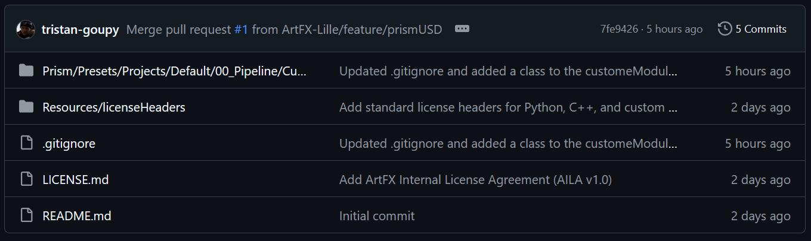

# GitHub Documentation

Welcome to the ArtFX Lille GitHub documentation.  
Through this documentation, you will learn the basics of GitHub and how to work in clean collaboration workflow. This document will be splitted for the different users (Readers, Writers, Admins, etc...) 

## Table of Contents

[1. Basics](#1-basics)

## 1. Basics

### Introduction

GitHub is home to millions of open-source software projects, that you can copy, customize and use for your own purposes.

There are different ways to get a copy of repository on GitHub. You can:

- **Download** a snapshot of a repository's files as zip file to you own (local) computer.
- **Clone** a repository to you local computer using **Git**.
- **Fork** a repository to create a new repository on GitHub.
  

Each of these methods has its own use case, which we'll explain in the next section.

### Understanding the differences between downloading, cloning and forking

| Term | Definition | Use case |
| ---- | ---------- | -------- |
| Download | To save a snapshot of a repository's files to your local computer. | You want to use or customize the content of the files, but you're not interested in applying version control
| Clone | To make a full copy of a repository's data, icluding all versions of every file and folder | You want to work on a full copy of the repository on your local computer, using Git to track and manage your changes. You likely intend to sync these locally-made changes with the GitHub-hosted repository. |
| Fork | To create a new repository on GitHub, linked to your personal account, that shares code and visibility settings with the original ("upstream") repository. | You want to use the original repository's data as a basis for your own project on GitHub. Or, you want to use the fork to propose changes to the original ("upstream") repository. After forking the repository, you still might want to clone the repository, so that you can work on the changes on your local computer.

### Cloning a repository
[Cloning a Repository GitHub Documentation](https://docs.github.com/en/repositories/creating-and-managing-repositories/cloning-a-repository?tool=webui)

### Navigating through repositories

Navigating through GitHub can be very intimidating, so here are a few guidelines to help you getting familiar with GitHub interface.

 

> This is the repository file structure. It contains all the files that will be downloaded or cloned.

When downloaded or cloned, you'll get the **same exact hierachy** on your local computer. When pushing and commiting on GitHub, the hierarchy from your local computer will be transfered.

