# ArtFX Lille Color Workflow for VFX Projects and CG projects
*ArtFX Lille Pipeline edition 2026.1.0*  
*by Gwenégan JOSSE and Garrett COOLIDGE*

This document will guide you through the whole color workflow fo both **VFX projects and full CGI projects**. Since the VFX color workflow is way more demanding and precise, this document will cover more this aspect than the CGI workflow.

## Table of Contents

- [Vocabulary](#vocabulary) 
- [VFX Workflow](#vfx-workflow)
  - [Overall Workflow](#overall-workflow)
  - [DaVinci Resolve Colorspaces Workflow](#davinci-resolve-colorspaces-workflow)
  - [Setup for Full Live Shots](#setup-for-full-live-shots)
  - [Setup for VFX Shots](#setup-for-vfx-shots-exr-final-comp-grade-version-1)
  - [Technical Grade in DaVinci Resolve for VFX Shots](#technical-grade-in-davinci-resolve-for-vfx-shots)
  - [Grade Versions in DaVinci Resolve for VFX Shots](#grade-versions-in-davinci-resolve-for-vfx-shots)
  - [Before Compositing](#before-compositing)
  - [After Compositing](#after-compositing)
  - [Exporting EXRs from DaVinci Resolve to Nuke](#exporting-exrs-from-davinci-resolve-to-nuke)
  - [Dealing with SONY Alpha7S III Footage](#dealing-with-sony-alpha7s-iii-footage)
  - [Preview Grading in your DCC Softwares with OCIO](#preview-grading-in-your-dcc-softwares-with-ocio)
  - [LUTs Customizations](#luts-customization)
    - [LIVE/VFX ARRI PROJECTS](#live--vfx-arri-projects)
    - [FULL CG PROJECT WORKFLOW (USING ACES TRANSFORM TO DISPLAY)](#full-cg-project-workflow-using-aces-transform-to-display)
  - [Compositing in Nuke](#compositing-in-nuke)
  - [VFX Ingest](#vfx-ingest)
- [CGI Workflow](#cgi-workflow)
- [Contact](#contact)

## Vocabulary

- **Technical Grade** (or Neutralization) :  Will be done on VFX shots to normalize the exposure and temperature . It will be baked in the EXR exported from DaVinci Resolve.
    > Using the **color checker** (or Macbeth) on set or not. It depends on what you aim for.

- **Primary Grade** : **Exposition, Contrast, Balance** and per shot adjustments made under the **Look** and after the **Technical Grade** (for VFX shots). It can be exported as LUT to help other artists.  
  Creating a Primary grade LUT will be covered later in this guide.
- **Creative Grade** : **Artistic look** defining the overall contrast, color palette, split toning of a sequence or the whole movie. This should be happening **right before your ARRI Display Transform Rec709 LUT**. This can be exported as a LUT to help other artists as well.  
  Creating a Crative grade LUT will be covered later in this guide.

## VFX Workflow

### Overall Workflow

Every **.mxf VFX shot** used in the editing will be identified then exported as an **EXR in ACES 2065-1 (AP0)** from the **ARRI Reference Tool** *(CMD script made by Tristan)* and imported back into DaVinci Resolve.  
It will replace the .mxf plate for VFX shots from there in the timeline. Then the **Technical Grade** will happen and when the clip is exported again as an EXR in ACES 2065-1 (AP0) *(e.g. for compositing)*.

> The ARRI Reference Tool step allows the EXR to **have metadata per frame written** inside the EXR in order to keep them during the whole post-production process.  
>
> ℹ️ The ARRI Reference Tool step is only useful if you shot with the proper lenses that can hold and capture informations per frames (e.g. Cooke with /i technology or ZEISS eXtended Data technology. For more informations, check [Cooke Official Website on /i technology](https://cookeoptics.com/i-technology/) and [ZEISS eXtended Data technology](https://www.zeiss.com/photonics-and-optics/en/cinematography/know-how-hub/extended-data.html) websites)

Please note that every shot going through compositing will enter Nuke as an **EXR in ACES 2065-1 (AP0)** and be exported as an **EXR in ACES 2065-1 (AP0) as well**. This is because **ARRI Wide Gamut 4 is actually larger than ACEScg (AP1)** and **ACES 2065-1 (AP0) is larger than ARRI Wide Gamut 4**.  

> ACES 2065-1 (AP0) > ARRI Wide Gamut 4 > ACEScg (AP1)

CGI renders from Maya/Houdini to Nuke can stay in ACEScg (AP1). You just have to **select the right Input Transform** in compositing for each element. This means VFX shots will have to be converted back from **ACES 2065-1 (AP0) to LogC4** when entering the final grading process in DaVinci Resolve. Whereas full live shots will only have **LogC4 to Rec709** transforms inside DaVinci Resolve.

### DaVinci Resolve Colorspaces Workflow

To keep your Davinci Resolve timelines and project clean, we recommend setting the project as shown and **never change it** if you don’t know what it means. In the **Davinci YRGB color science**, set the timeline colorspace to **ARRI LogC4**, and the output to **Rec.709 Gamma 2.4**. Set the 3D lookup table interpolation to **Tetrahedral**.

<figure>
    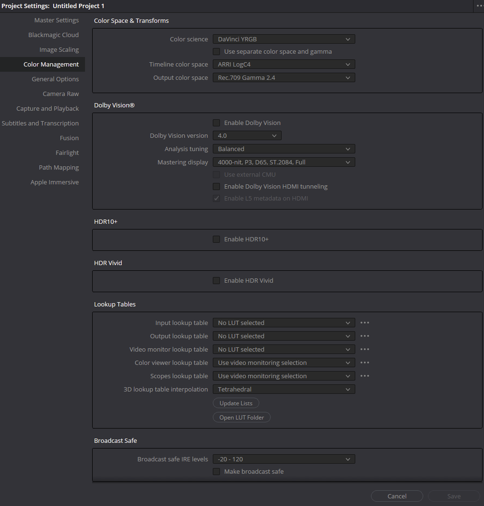
    <figcaption> DaVinci Resolve Color Management panel </figcaption>
</figure>

Every live/VFX movie will use an **ARRI Reveal LUT** to go from Log to Display Rec709. Any grading modification will happen in the LogC4 colorspace before the display transform. 

### Setup for Full Live Shots

<figure>
    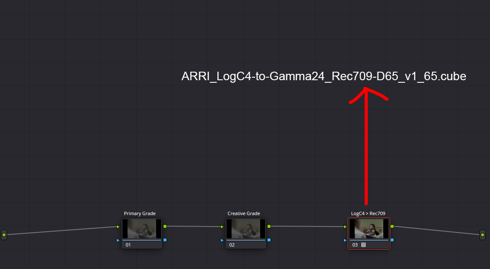
    <figcaption> Rec709 viewed through ARRI Reveal Lut for full live shots  
                 (ARRI_LogC4-to-Gamma24_Rec709-D65_v1_65.cube) </figcaption>
</figure>

[Download ARRI LogC4 LUTS package here](https://www.google.com/url?q=https://www.arri.com/resource/blob/280728/77e1e29f98a7cd1b8dbf821692d23f07/arri-logc4-lut-package-data.zip&sa=D&source=docs&ust=1762697862374216&usg=AOvVaw3zg1Jm6lKzot0Lsj9lXmgR)

### Setup for VFX Shots (EXR final comp grade version 1)

<figure>
    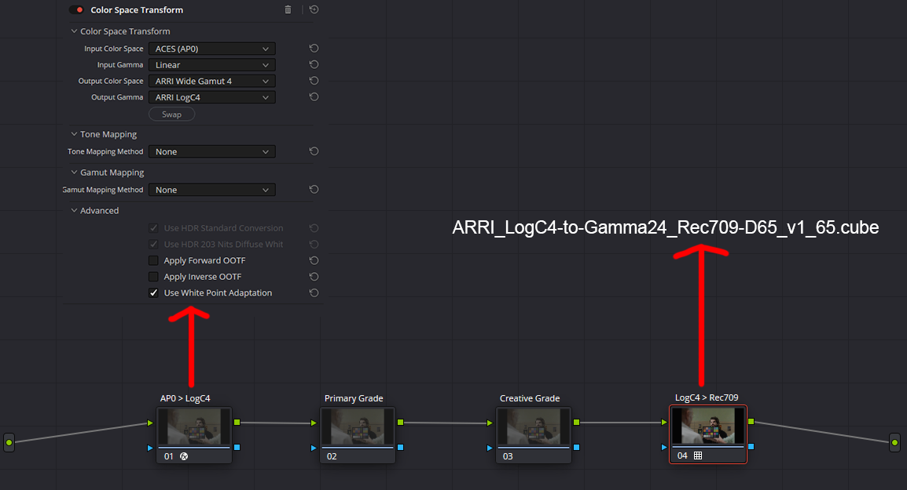
    <figcaption>Final compositing converted back to LogC4 for grading and then viewed through ARRI Reveal Lut (ARRI_LogC4-to-Gamma24_Rec709-D65_v1_65.cube) </figcaption>
</figure>

### ⚠️ When using the Color Space Transform to convert from ACES 2065-1 (AP0) to LogC4, set *Tone Mapping Method* and *Gamut Mapping Method* to **NONE**

### Technical Grade In DaVinci Resolve for VFX Shots

Before exporting EXRs to Nuke, you can do **Technical Grade** on VFX shots grade Version 1 if needed to normalize the exposure and temperature. Those should be small adjustments. Those **Technical Grade** will be baked in the EXR. 

Make the Technical Grade under the ARRI Reveal LUT to display. This way, it will work in LogC4 and ensure that the Technical Grade are still accurate when starting the actual grade at the end of the year. 

<figure>
    
    <figcaption> Grade version 1 for your EXR plate, Technical Grade viewed through an ARRI Reveal Lut (ARRI_LogC4-to-Gamma24_Rec709-D65_v1_65.cube) </figcaption>
</figure>

### Grade Versions in DaVinci Resolve for VFX Shots

Having different versions allows you to switch quickly between conversions depending on what you need to display or render and keep project settings the same. We recommend having **2 versions per EXR plate and at least 1 version per EXR final comp**. Using grade versions will prevent anyone from changing the project settings and making mistakes.  
You can create a grade version by **right clicking on your clip in the Color page** , then  in `Local Versions > Create New Version`.

### Before compositing

**Version 1** (EXR plate from ART) is doing ACES 2065-1 (AP0) > LogC4 > Display. It is your **Rec709 viewing** for editing and Technical Grade if needed. Do your Technical Grade on the empty node prior to the ARRI Rec709 conversion. The Version 1 grade is used in the early phase of editing.

<figure>
    
</figure>

**Version 2** (EXR plate from ART) is doing ACES 2065-1 (AP0) > LogC4 > ACES 2065-1 (AP0). Used to export EXRs for comp with Technical Grade baked in. Copy the Technical Grade you did on version 1 on a node between the two Color Space Transform instances.

<figure>
    
    <figcaption> Converting LogC4 to ACES 2065-1 (AP0) for ARRI Alexa35 shots before exporting as an EXR for Nuke </figcaption>
</figure>

### After Compositing

**Version 1** (EXR comp)  is your final grade version. It will have the setup for VFX shots. There, you can add your Primary Grade and Creative Grade.

> Refer to [**Setups for VFX shots**](#setup-for-vfx-shots-exr-final-comp-grade-version-1) for Nodegraph

### Exporting EXRs from DaVinci Resolve to Nuke

After finishing your Technical Grade, you need to export your footage . To do this, apply **Version 2** on the exr plate. Copy the Technical Grade you did on Version 1. Now it contains your Technical Grade baked in and the LogC4 to ACES 2065-1 (AP0) conversion.  
Export the footage in the **RGB half OpenEXR format**.

### Dealing with SONY Alpha7S III Footage

Since the project and the whole pipeline is based on the ARRI Alexa 35’s LogC4 colorspace, shots captured on the SONY Alpha7S III camera need to be transformed from **S-Log3/S-Gamut3.Cine *(or S-Log3/S-Gamut3)* to LogC4**.  
To avoid huge grading corrections to match both cameras, we managed to extract LUTS from the plugin **CineMatch**. They will take you to LogC4 as they include a Color Space Transform (CST) and a sensor match between both cameras.

#### SONY Log to ARRI Log LUT files

[S-Log3/S-Gamut3.Cine to LogC4 LUT](https://drive.google.com/file/d/1YfZrHibV7_Ix6yeF_N-FZRlCkJlB9A7l/view?usp=drive_link) 

[S-Log3/S-Gamut3 to LogC4 LUT](https://drive.google.com/file/d/1DXajpbTG529p65K3hu3B4br2frJHfIpc/view?usp=drive_link)

Once your SONY footage is in the same colorspace as the ARRI Alexa 35, you can follow almost the same pipeline as for the latter. With the difference that SONY’s shots before the DaVinci Resolve export to EXR won’t have the IDT going from ACES 2065-1 (AP0) for ProRes RAW plate grade Version 1 and 2 because there is no export from the ARRI Reference Tool in this case.

EXRs final comp shots from Sony follow the same Pipe as Alexa’s since it will enter Davinci in ACES 2065-1 (AP0).

For full live shots, follow the [**Setups for full live shots**](#setup-for-full-live-shots) section and just apply the LUT at the beginning of the nodegraph.

 

<figure>
    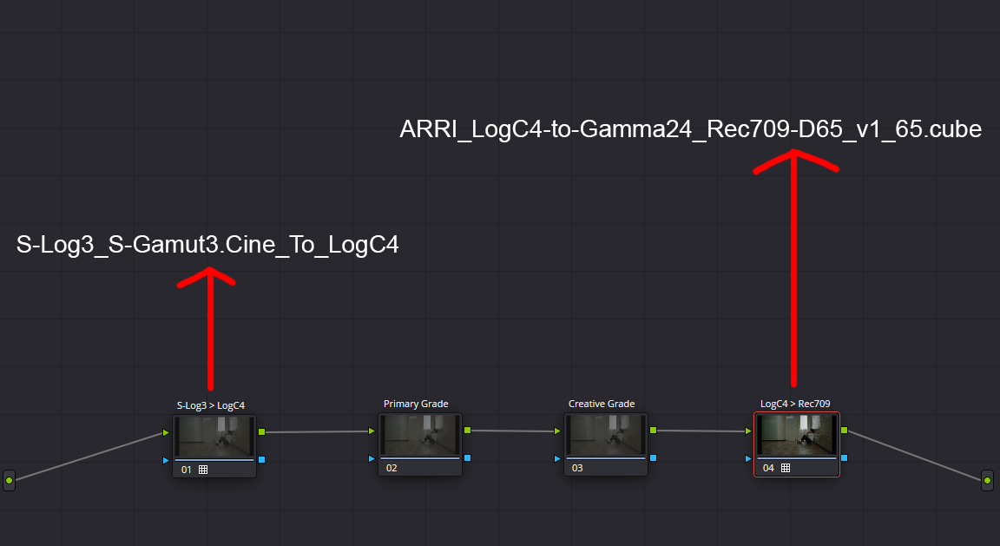
    <figcaption> Setup for SONY full live shots. Converted to LogC4 and then Rec709 view through an ARRI Reveal Lut (ARRI_LogC4-to-Gamma24_Rec709-D65_v1_65.cube) </figcaption>
</figure>

You just need to have the LUT at the beginning of your DaVinci Resolve nodegraph for VFX shots grade Version 1 and 2 of your ProRes RAW plate.

<figure>
    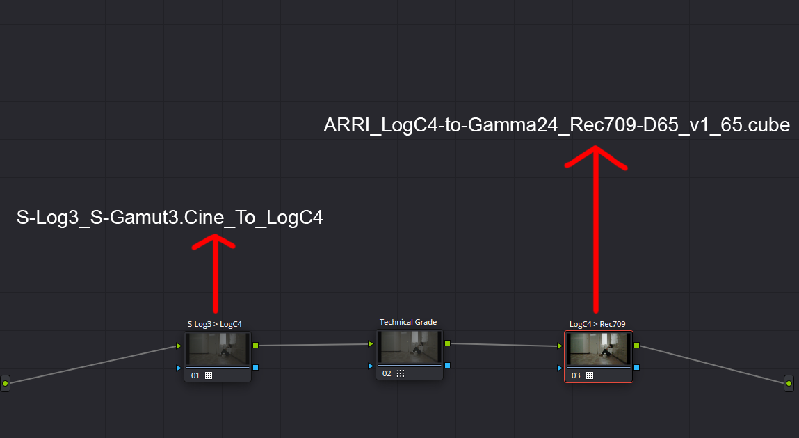
    <figcaption> Setup for ProRes RAW plate grade Version 1. Same as SONY full live shots setup except for the node in the middle </figcaption>
</figure>

<figure>
    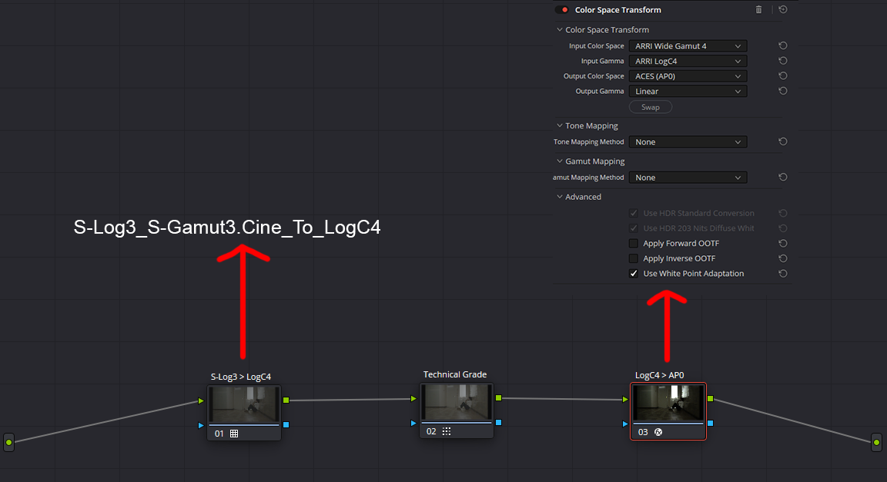
    <figcaption> Setup for ProRes RAW plate grade version 2. Identical to Alexa’s, just with the S-Log3 to LogC4 conversion instead of the AP0 > LogC4 conversion </figcaption>
</figure>

### Preview Grading in your DCC Softwares with OCIO

Your software has to use the **custom OCIO** config we built for 2026 PFEs.  
Prism will set it up for you automatically :

All the projects will use the same OCIO config located here :  

``V:\_PIPELINE\OCIO\aces_1.3\``  

The folder contains the following : 

    aces_1.3\
        custom-config-vX.Y.Z_aces-v1.3_ocio-v2.1.ocio (versioning of the config)
        config.ocio (config used by default, will be override when correcting bugs)
        luts\ (arri reveal luts)
            ARRI_LogC4-to-Gamma24_Rec709-D65_v1-65.cube (arri reveal lut)
            ARRI_LogC4-to-Gamma24_Rec2020-D65_v1-65.cube
            ARRI_LogC4-to-Gamma26_P3-DCI_v1-65.cube

### ❗DO NOT edit those files❗

*If you really want to add new functionalities to the OCIO config, contact first your Pipeline TD supervisor, your VFX supervisor and your CG supervisor. Don't take initiatives, ask first !*

Here are all the **display views available** : (the custom ones are highlighted)

- Rec.1886 Rec.709 - Display
  - Live ARRI Reveal
  - Live ARRI LogC4
  - Live ARRI Shot
  - Live ARRI Shot Sequence
  - Live ARRI Sequence
  - Live ARRI Movie
  - Full CG Sequence
  - Full CG Movie
  - ACES 1.0 - SDR Video
  - Un-tonne-mapped
  - Raw
- sRGB - Display
  - ACES 1.0 - SDR Video
  - Un-tonne-mapped
  - Raw
- Rec.1886 Rec.2020 - Display
  - Live ARRI Reveal
  - ACES 1.0 - SDR Video
  - ACES 1.1 - SDR Video (p3 lim)
  - ACES 1.1 - SDR Video (Rec.709 lim)
  - Un-tonne-mapped
  - Raw
- P3-DCI - Display
  - Live ARRI Reveal
  - ACES 1.0 - SDR Cinema (D60 sim on DCI)
  - ACES 1.1 - SDR Cinema (D65 sim on DCI)
  - Un-tonne-mapped
  - Raw

### LUTs Customization

#### LIVE / VFX ARRI PROJECTS

For each project, you can preview a lut for every shot (Primary Grade), every sequence (Creative Grade) or the whole movie (Creative Grade). Those LUT are mostly aimed at being used in compositing.  
You have to create your Primary Grade and Creative Grade adjustments separately under the ARRI Reveal Rec 709 Transform so that it behaves in LogC4. Disable the ACES and Rec709 transform and the grade you don’t want to export. For example, if you want to export your Creative Grade LUT, just disable everything except the Creative Grade Node. Primary and Creative Grade should never be contained in the same LUT as Primary Grade is variable for every shot.

<figure>
    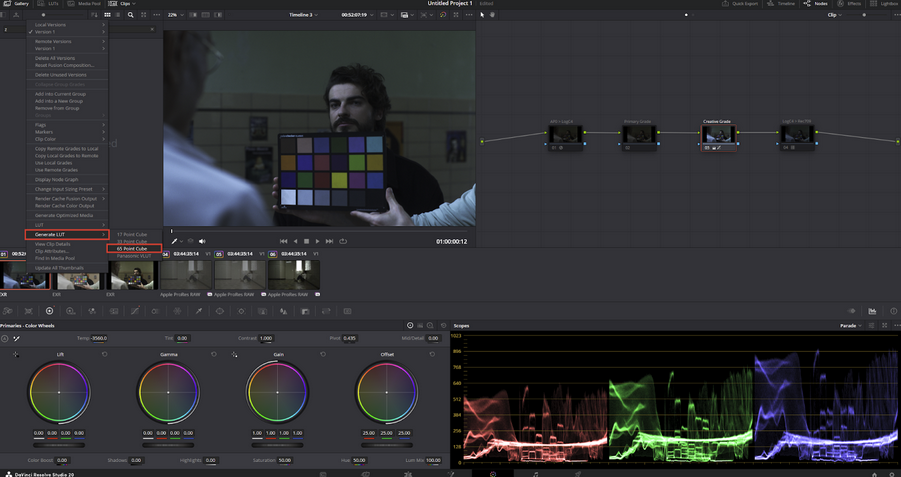
</figure>

Then export the LUTs to this location :

`V:\{PRJ}\00_Pipeline\OCIO\luts_custom\` (*the {PRJ} is the three letters from your project*)

Rename your LUT with this exact naming convention :  

For each shot LUT: `ARRI_LogC4-to-LogC4_sh####.cube`  

For each sequence LUT : `ARRI_LogC4-to-LogC4_sq###.cube`  

For movie LUT : `ARRI_LogC4-to-LogC4_MOVIE.cube`  

⚠️ **sq#### and sq#### must have the exact same name as your sequence and shot in Shotgrid/Prism**  

⚠️ **DaVinci Resolve will add the clip name to the name of your LUT, you have to delete it to match the naming convention above**  

#### FULL CG PROJECT WORKFLOW (USING ACES TRANSFORM TO DISPLAY)

⚠️ **Your DaVinci Resolve must use the correct color management. Corrections have to be made in ACEScct and use the ACES to display transform** 

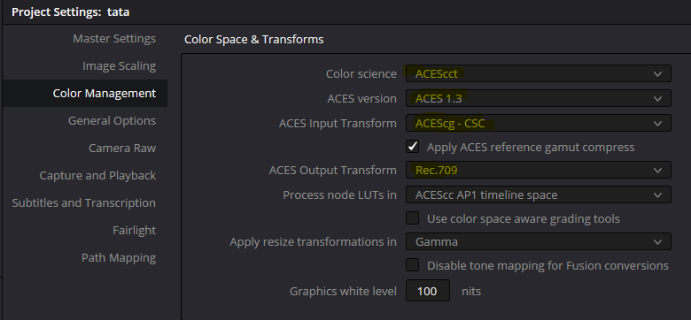

Grade your footage as you want, then right-click on the clip and generate the LUT.

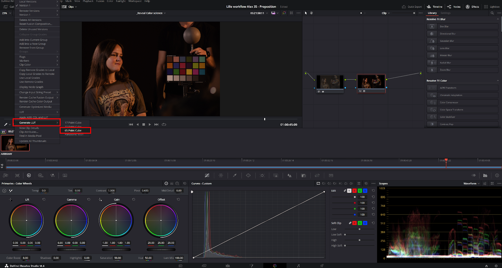

Then export the LUTs to this location :

`V:\{PRJ}\00_Pipeline\OCIO\luts_custom\` (*the {PRJ} is the three letters from your project*)

Rename your LUT with this exact naming convention :  

For each sequence LUT: `CG_Acescct-to-Acescct_sq###.cube`  

For movie LUT: `CG_Acescct-to-Acescct_MOVIE.cube`

⚠️ **sq#### and sq#### must have the exact same name as your sequence in Shotgrid/Prism**  

⚠️ **DaVinci Resolve will add the clip name to the name of your LUT, you have to delete it to match the naming convention above**  

Now in your favorite DCC Software, you can select :

- **Live ARRI Shot** to preview your work with the LUT of the shot based on the shot you are working in. Using ARRI Reveal.
- **Live ARRI Shot Sequence** to preview your work with the LUT of the shot based on the shot of the sequence you are working in. Using ARRI Reveal.
- **Live ARRI Sequence** to preview your work with the LUT of the sequence based on the sequence you are working in. Using ARRI Reveal 
- **Live ARRI Movie** : to preview your work with the global lut for your project. Using ARRI Reveal 
- **Full CG Sequence** to preview your work with the LUT of the sequence based on the sequence you are working in. Using ACES display transform.
- **Full CG Movie** to preview your work with the global lut for your project. Using ACES display transform. 

### Compositing in Nuke
Prism will set it up for you, we will use this config :

`Artfx-config-pfe-2026_v5.0.0_aces-v1.3_ocio_v2.1`

Set the input transform of the plate footage on **aces_interchange(ACES2065-1)** *(only for live plates, not 3d renders)*

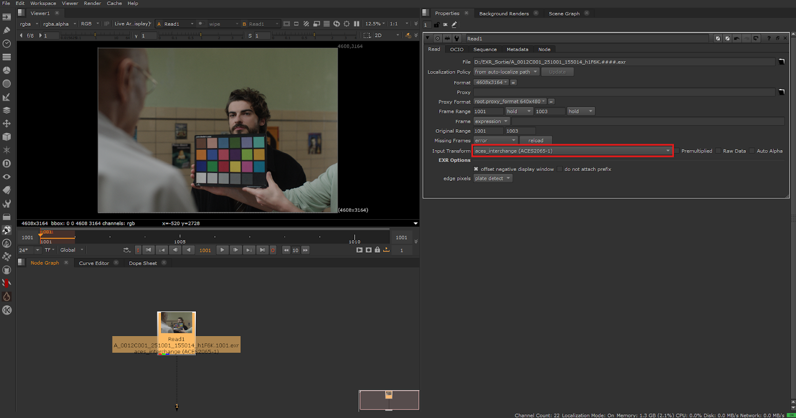

The comp artist can choose to preview the final comp in Rec709 using Live Arri Reveal or any Arri Reveal related view (shot, shot sequence, sequence, movie) using view transform.  
After compositing, set the output transform of your write node to **aces_interchange(ACES2065-1)** and enable `write ACES compliant EXR`.

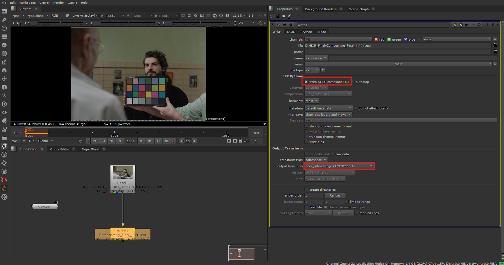

### VFX Ingest

Ingest your VFX shots inside the Davinci Resolve Project.  
On your EXR final comp grade version 1, do the ACES 2065-1 (AP0) to LogC4 conversion following what is written in the nodegraph in the [Setups for VFX shots section](#setup-for-vfx-shots-exr-final-comp-grade-version-1).

## CGI Workflow

### 🚧 This section is still under construction. We'll keep you notified when this section is done.

## Contact

If you have questions or feedbacks, contact [Gwénégan JOSSE](mailto:gwenegan.josse@vingtquatre.school) or [Garrett COOLIDGE](mailto:garrett.coolidge@artfx.fr) by their school e-mails.

