# A to Z VFX Workflow
*version 2026.1.0 for ArtFX 2026 promotion*

In this document, you will learn the proper workflow for your exports and for your EXR files from your footage.  
Once your edit in **DaVinci Resolve** is locked (final version or close to final), you can begin the **VFX Workflow**.

## Table of Contents

[Preliminary Information](#preliminary-information) 
[1. Convert .MXF to .EXR with Baked Metadata](#1-convert-mxf-to-exr-with-baked-metadata-using-arri-reference-tool-art) 
[2. Replace .MXF with ART .EXRs Using Reconform](#2-replace-mxf-with-art-exrs-using-reconform) 
[3. Technical Grade and Export all Plates](#3-technical-grade-and-export-all-plates) 
[4. Export your References Plates](#4-export-your-references-plates)

## Preliminary Information

- This workflow follows the **Color Pipeline** developed by Gwénégan and Garrett. You can find the full documentation here : 
- The first step in the workflow uses the **ARRI Reference Tool (ART)** to bake the camera into each frame. Tristan created a script to bridge DaVinci Resolve to this tool. Documentation is available here : 
- For artists. Our color workflow is based on the **ARRI Reveal Color Science**. This means that in every DCC software used for **texturing, shading, or rendering,** you must ensure your display LUT is set to : **“Live Arri Reveal - Rec.1886 Rec.709 - Display”**. 
  
  - In Nuke : 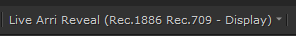
  - In Houdini : 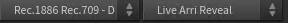
  - In Substance :
  - In Mari :

## 1. Convert MXF to EXR with Baked Metadata Using ARRI Reference Tool (ART)

The first is to export your **ARRI plates** using the **Tristan ARRI Reference Tool Bridge**. The goal is to replace your **timeline .mxf files** with **EXR sequences** that include baked camera metadata for each frame. For now, you can store these files in your **Shooting / OnSetProduction** folder.

<figure>
  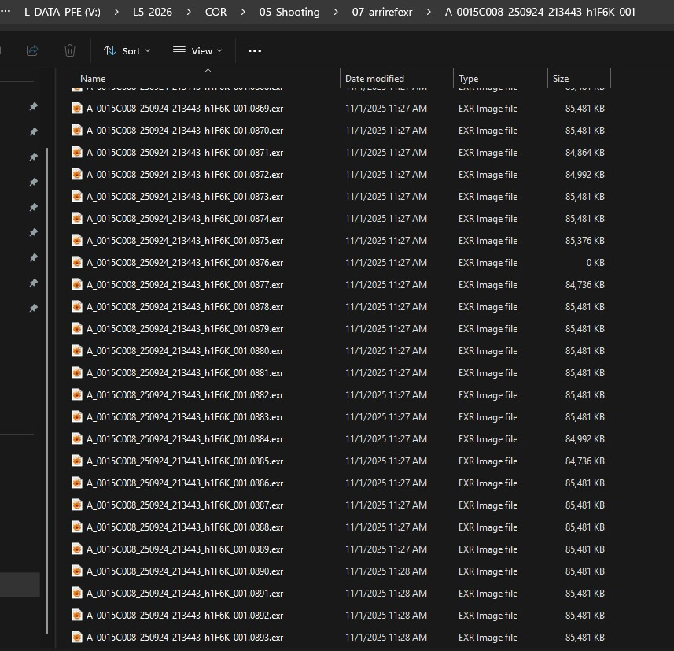
  <figcaption> ARRI Reference Tool Output </figcaption>
</figure>

The CMD script exports your footage using the *source name* of your clips, so you’ll need to rename them manually. You can use tools like **Bulk Rename Utility** or **PowerRename**, whichever you prefer. For this example we are using PowerRename:

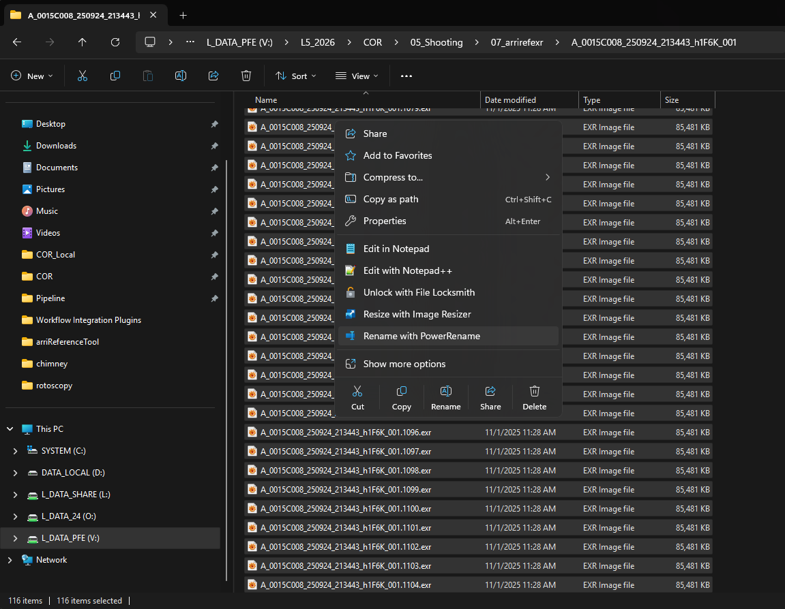
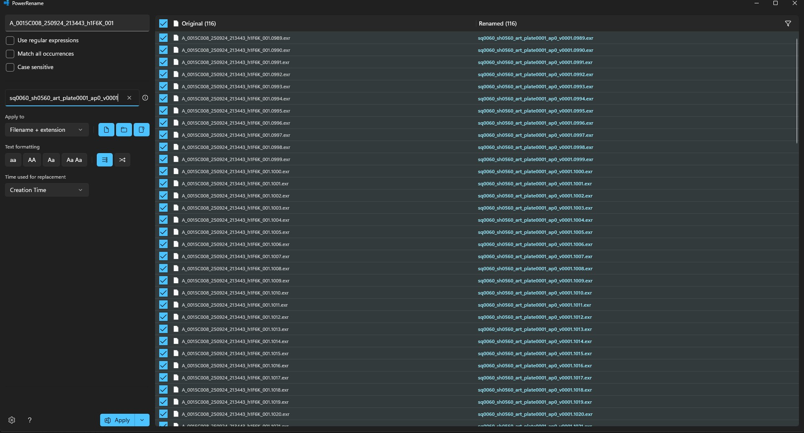

Proper Naming Convention : `sqXXXX_shXXXX_art_plate0001_ap0_vXXXX.####.exr`

Once the files are correctly renamed, import your footage into your **Prism project** under the appropriate **shot**.

1. Go to the shot corresponding to this footage
2. Create a new identifier named **art_plate0001_ap0** (Type: 2D)
3. Use the **“Copy Path for Next Version”** function

This will automatically create an empty **v0001** folder containing a `.json` file. This ``.json`` file acts as a reference for the correct naming convention.  
Whenever you manually import external files into your Prism project, use the **“Copy Path for Next Version”** option to ensure consistency.

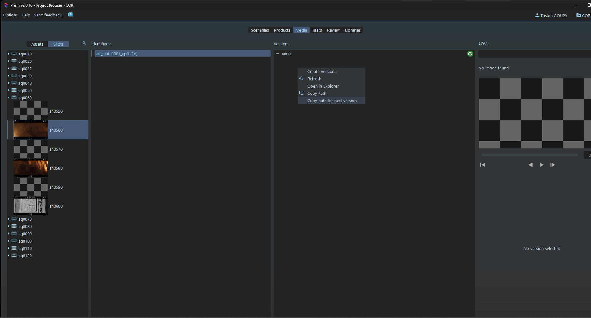
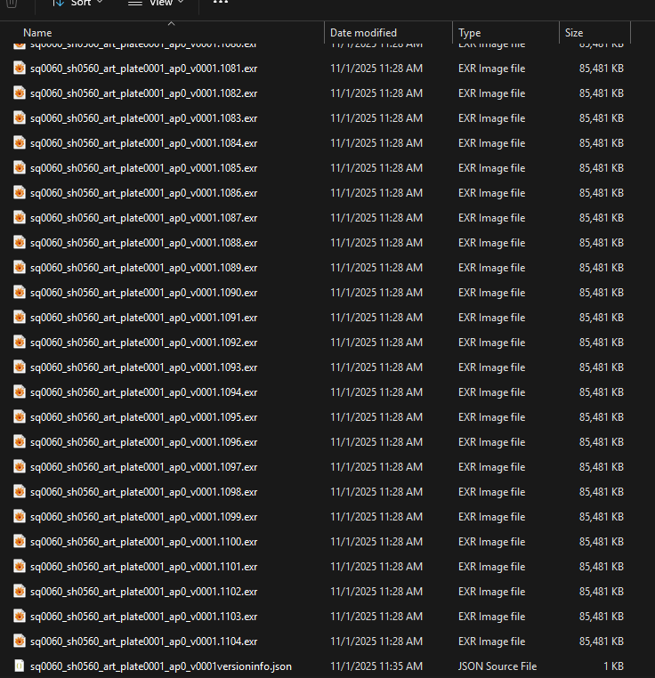

Once all your **ART EXRs** are exported and organized, you can move on to the next step.

## 2. Replace .MXF with ART .EXRs using reconform

In this step, we’ll replace the **original MXF files** in your DaVinci Resolve timeline with the **ART EXR sequences**.

### 2.1. Import the EXR images sequences

   In **DaVinci Resolve**, create a new **bin** and import all your **ART EXR images sequences** into it.

### 2.2. Duplicate your timeline

Before making any changes, **duplicate your edit timeline** to keep a safe backup of the original MXF version.
You can keep your original track and duplicate it. For example here I used the second track to rename the shots (on the “Name Clip”) to get the proper shot cuts.

### 2.3 Prepare for reconform

- In your timeline, select the clips you want to replace.
- Right-click to one of the selected and choose **“Conform Lock Enabled”**.  
This unlocks the conform settings for those clips and prepares them for reconform.

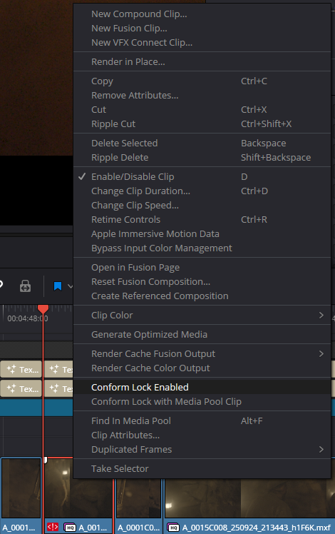

### 2.4. Run the reconform process

- Right-click on the duplicate timeline
- Go to **Timeline → Reconform from Bins.**

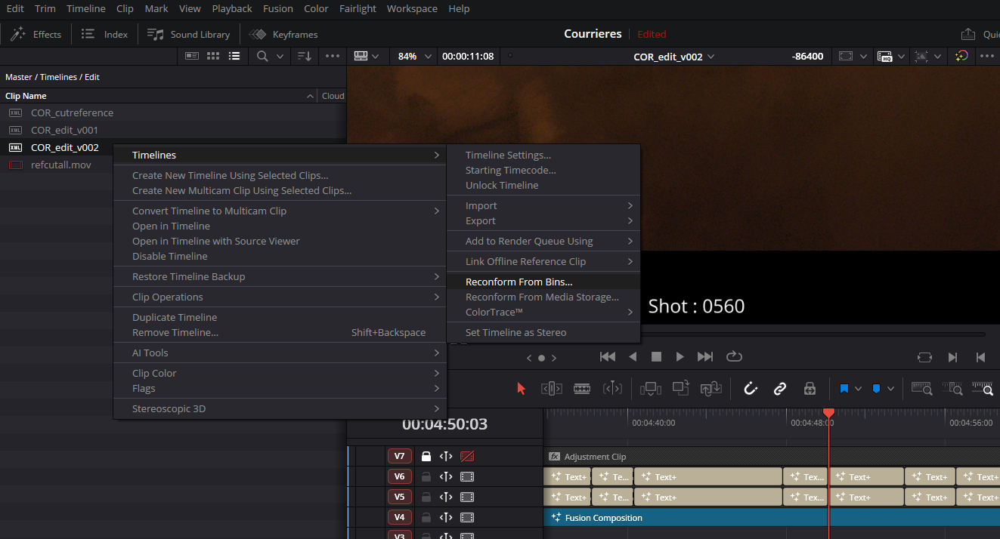

- The **Conform from Bins** window will appear.

### 2.5 Configure the settings

- Select the bin that contains your **ART EXR shots**.
- Enable both **“Timecode”** and **“Source Timecode”**.

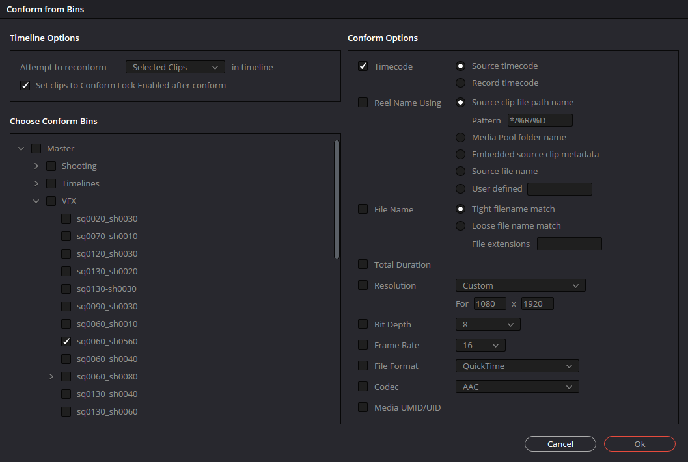

This process will automatically locate the correct **ART EXR** sequences based on their source timecode and replace the corresponding **MXF files** in your timeline.  
Once the reconform is complete, your edit will now reference the baked **ART EXR plates** instead of the MXF sources. Be sure to verify that every conformed shot is well placed → you can use the “Disable Video Track” button to compare with the MXF.

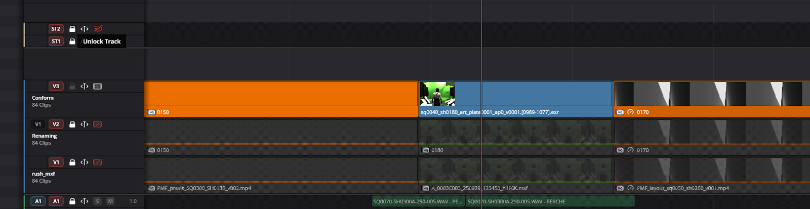

When your new **EXR files** have successfully replaced the MXF sources in your timeline, you can **archive the original MXF files** stored on the **Data PFE** (on your external HDD) and then **delete them from the Data PFE** to free up storage space. Every VFX Project has 10 To storage.

### ⚠️ Make sure all necessary backups or archive versions are saved before deleting the MXFs if you do this.

## 3. Technical Grade and Export all Plates
The third step is to perform a **technical grade** on all your shots, following the [**VFX Color Pipeline**](../color_workflow/COLOR_WORKFLOW.md).

### 3.1 Set Up the Color Pipeline - Version 1 (TECH GRADE Rec709 LUT)
   
- Go to the Color Tab.
- Add a **Color Space Transform** node that converts from **AP0 (Linear)** to **AWG4 (LogC4)** →  This ensures your **Timeline Working Space** is in **AWG4–LogC4**.

  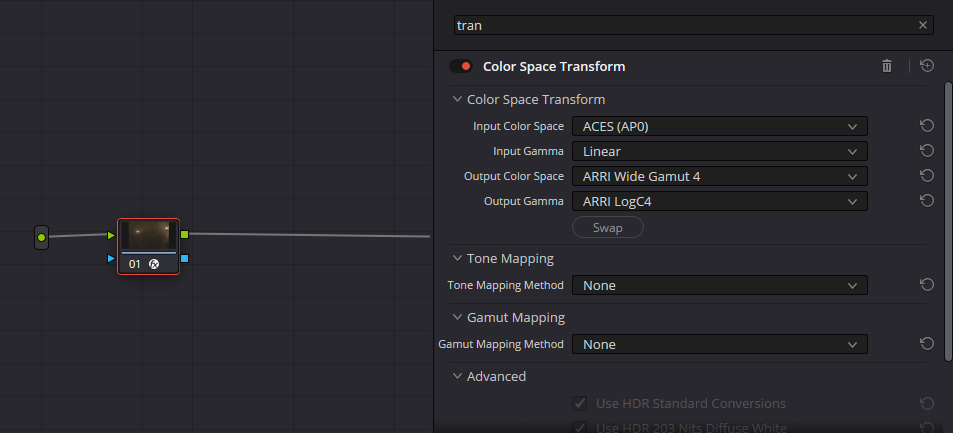

- Add another **serial node** and apply the **ARRI Reveal LUT**: `ARRI_LogC4-to-Gamma24_Rec709-D65_v1_65`

  

This converts your output back to the correct Rec.709 ARRI Reveal color space. Your **technical grade** should be done **between these two nodes**. This is where you neutralize all of your footage.

<figure>
  
  <figcaption> 
  
  This setup is referred to as **Version 1 – Before Comp Setup** *(see the Color Pipeline documentation)*. 
  </figcaption>
</figure>

### 3.2. Set Up the Color Pipeline - Version 2 (EXR AP0 EXPORT)
   
Once your **technical grade** is complete, proceed to the **export stage**. At this point, create a **new grade version** of your clip

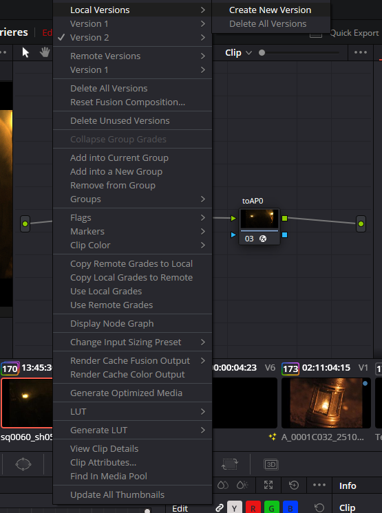

This **Version 2** will be the configuration used **before exporting your VFX plates**. Replace the **ARRI Reveal LUT** with a Color Space Transform going from **LogC4 → AP0**. 

<figure>
  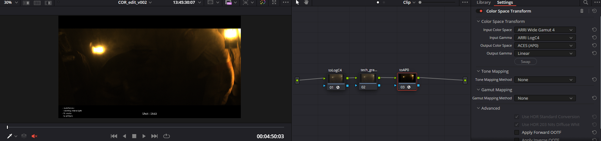
  <figcaption>

  This setup is referred to as **Version 2 – Before Comp Setup** *(see the Color Pipeline documentation)*.
  </figcaption>
</figure>

If you want to switch between versions in the color tab you can use the shortcut Ctrl+B.

### 3.3 Prepare Metadata and Naming Before Export

Before exporting, you’ll use **DaVinci Resolve’s Variables** to generate the correct file naming convention automatically.

- Go to the **Metadata** panel and verify all information for each VFX shot.
- Ensure the following metadata fields are correctly filled out:
  
  - `Name`: This will act as the **SHOT name**. We use the Name field instead of the Shot metadata field because the same clip may be used in multiple shots. This workaround ensures proper **Data Burn-in generation** and will also help us keep accurate track of shot usage later.
  - `Scene`: This corresponds to the Sequence.
  - `Comments`: This field represents the plate version.
    Use the following logic: If the shot contains only one plate → set the value to *plate0001*.  
    If multiple plates are used for the same shot → assign one version per plate (*plate0001, plate 0
    002, plate0003*, etc...).
  - `ISO`: This field is critical for the denoising step. Verify that all plates have the correct ISO information.

<figure>
  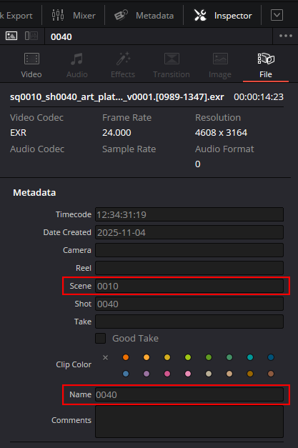
  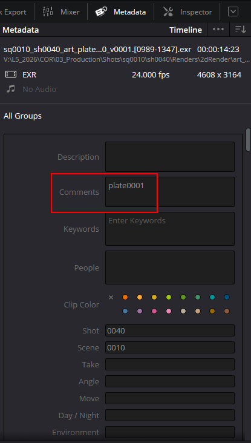
  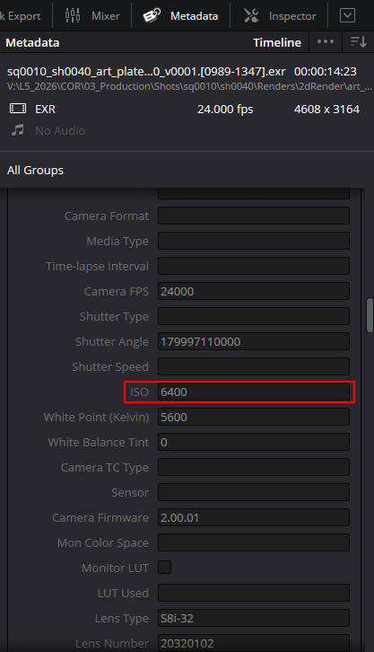
</figure>

### 3.4. Export Settings

- Go to the Delivery tab.
- Use the Custom preset : `plate_ap0_preset`

  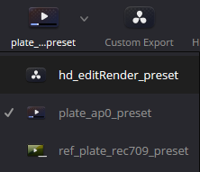

- You need to fill manually the **Location** tab since the preset doesn’t save it. To get the proper path and avoid manual Identifier creation inside of prism, here is the path:

> `V:\L5_2026\[PJC]\03_Production\Shots\sq%SCENE%\sh%CLIPNAME%\Renders\2dRender\%COMMENTS%_ap0\v0001`  
> [PJC] = The 3 letters of your project.  
> %SCENE% (our sequence), %CLIPNAME% (our Shot number) and %COMMENTS% (our plate number) are the Resolve’s variables which use the metadata of your clip.

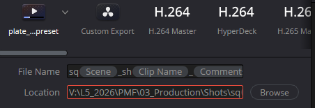

Once this is set, the preset will automatically export all shots into the correct **Prism directory**.

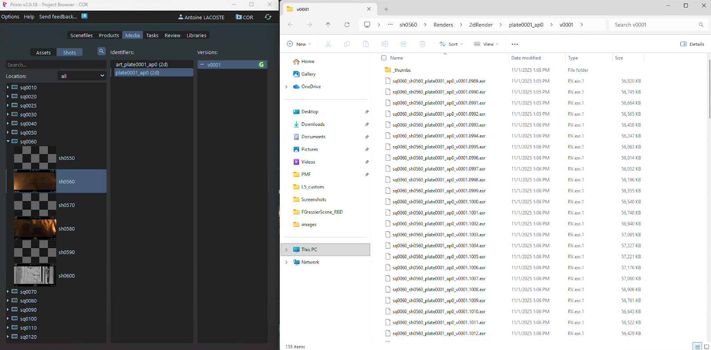

### 3.5. Preset Configuration Summary

The preset includes the following settings :

- **Automatic file naming** using Resolve variables: `sqXXXX_shXXXX_plate000X_ap0_v0001.####.exr`.
- **Individual clips**.
- **EXR RGB Half** with PIZ compression.
- **Render at source resolution**.
- **Disable sizing and blanking output** (no transform or blanking)
- **12-frame handles** (24 total).
- **4-digit frame numbers**.
- **Start frame** 989 *(frame 1001 is always the first frame of your shot in the edit)*.
### 3.6. Render

Once all your footage is properly set up with the correct metadata and export settings, you can **start rendering** your VFX plates.  
Don’t publish this on Shotgrid but put the plate status of the exported plates in “Complete".  

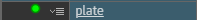

## 4. Export your References Plates

In this step, you’ll export the **reference plate**s as *.mov* files for the artists.  
These files need to carry the **final format**, **final edit**, and **final color**, including any **transforms**, **retimes**, and **grading** baked in.

### 4.1 Prepare the Timeline

- Duplicate your edit timeline and rename it: `refExport`
- We will now export each shot as a **single .mov file** with:
  - Final frame cut
  - Final timing
  - Final color grade
  - All transforms and effects applied
  - Data burn-in
  - VFX description list

Below is the reference look you should obtain at this end of this process:

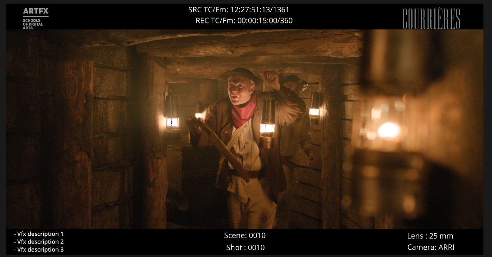

> If the shot is a Computer Generated Image (CGI, 2D Animation, Motion-Design…), put a storyboard / 3D layout as a reference plate.

### 4.2. Apply the Data Burn-In

Use the Data Burn-In preset called `Reference_DataBrunInPreset`.

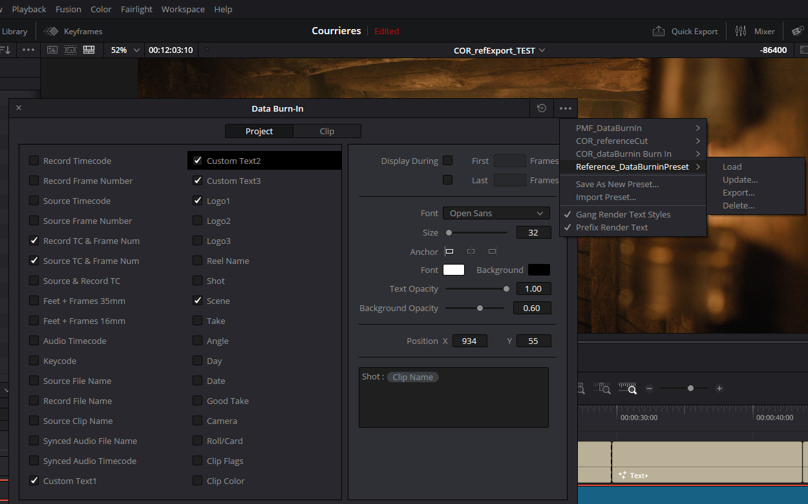

You may customize this preset (for example, adding your movie logo).  
Save it as a new custom preset for your project.  

> For example : `[PJC]_DataBurnIn`

For now, this is what you should have:

### 4.3. Add Blackbands & VFX Description Text

We must manually add the black bands and overlay the VFX description.

- **Create a new track** → name it *Crop Ratio*
- Add an **Adjustment Clip**
- Go to **Inspector → Video → Cropping**
- Apply the correct Crop Ratio values :  
For the Scope format :

  - Height: 1080
  - Scope height: 858
  - Crop value = `(1080 - 858) / 2 = 111`
  
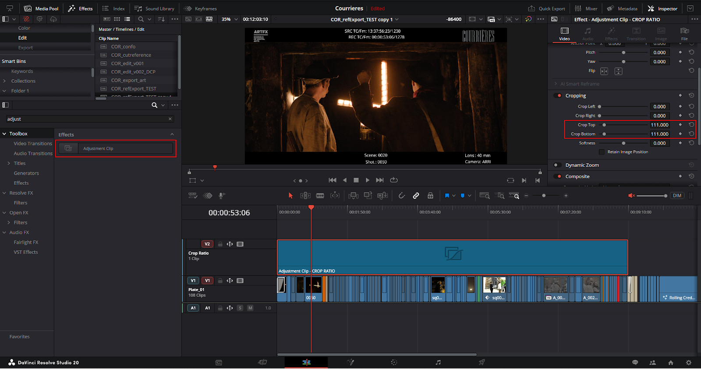

- Add a **Text node for each shot**, place it in the **bottom-left corner**, and write your VFX task list.
  
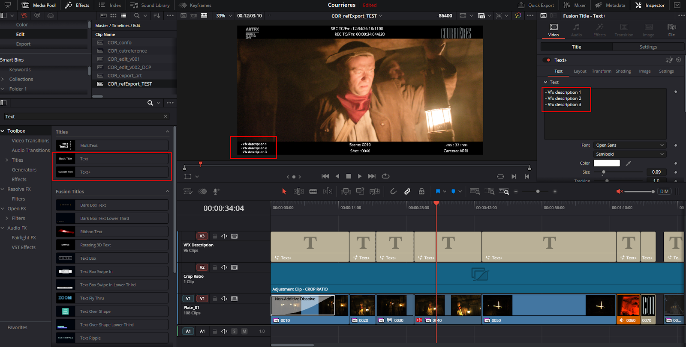

### 4.4 Export the Single Reference Plate (.mov)

Go to the Delivery tab and select the preset :
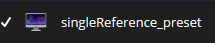

  **Location Setup**:

      [YourEditingFolder]/
        referencePlate/
          singleReferenceClip/
              v0001/

### ⚠️ Important

Make sure your timeline has **all your color grading active**, with the **ARRI Reveal LUT enabled**, so the final look is properly baked into the MOV. 

Render your single reference plate.

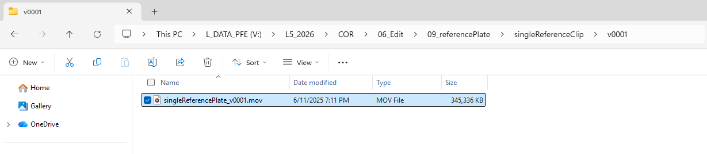

### 4.5 Generate Individual Reference Clips

Once the `singleReferencePlate.mov` is rendered:  

- In DaVinci Resolve, create a new bin: `ReferenceCut → SingleReferenceClip`
- Import the `.mov` file you just exported.
- Duplicate your timeline again → rename it: *refCutExport*
- Create a new track called **CUT**, place your `.mov` on this track, and disable Data Burn-In if needed.

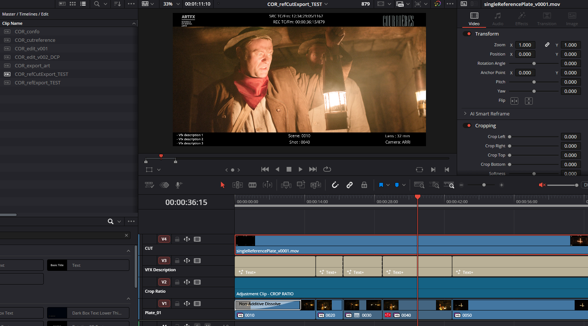

Your imported MOV should perfectly match the original edit.  

### 4.6 HD Timeline Resolution

We want the Final reference export to be delivered in **1920 x 1080 HD.**  

To update the timeline resolution :  

- Right-click on your timeline *refCutExport*
- Go to **Timeline → Timeline Settings**
- Set the resolution to **1920 x 1080 HD**
- Under Mismatched Resolution, select: "**Scale entire image to fit**"
- Click **OK** to apply

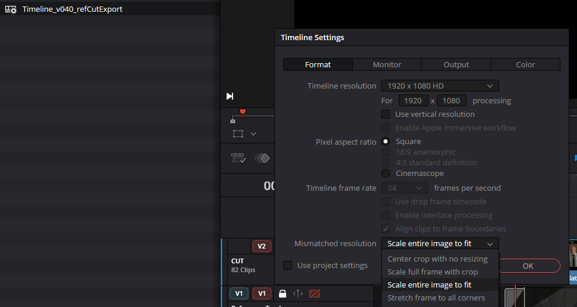

### 4.7 Perform Scene Cut Detection

- Lock all tracks **except the CUT track**.

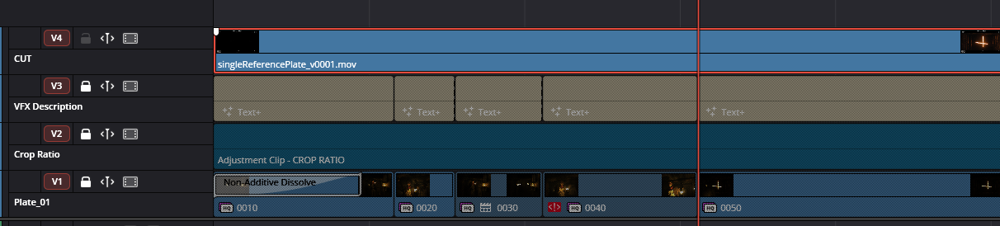

- Then in **Timeline → Detect Scene Cuts**

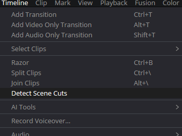

DaVinci Resolve will automatically slice the single reference plate into individuals shots.

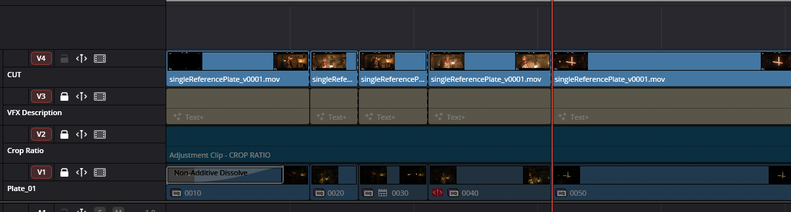

Review all cuts to make sure they are correct. When approved, delete all the other tracks.

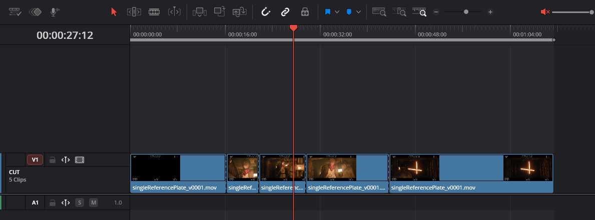

### 4.8 Export individual References Plates

In the delivery page, use the preset `individualReference_preset` 
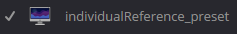

**Location setup :**

In your project directory :  

    06_Edit/
      referencePlate/
        individualReferenceClip/
          v0001/

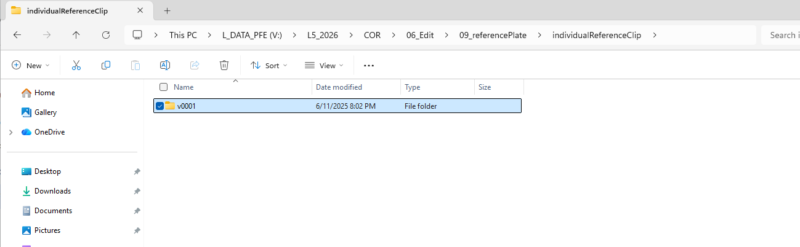

Render all the individual reference shots.

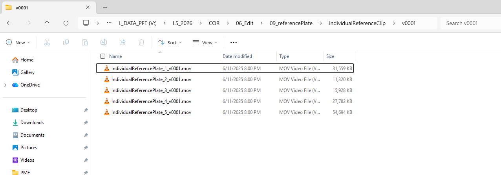

### 4.9 Ingest the Reference Plates in Prism

For each shot :

- Open the **Media** tab of the shot in Prism
- In the **Identifiers** tab → Right-click → **Ingest Media**

- Assign the identifier according to naming conventions : `ref_plate_rec709`
- Drag and drop the correct `.mov` into the **Media Path**.

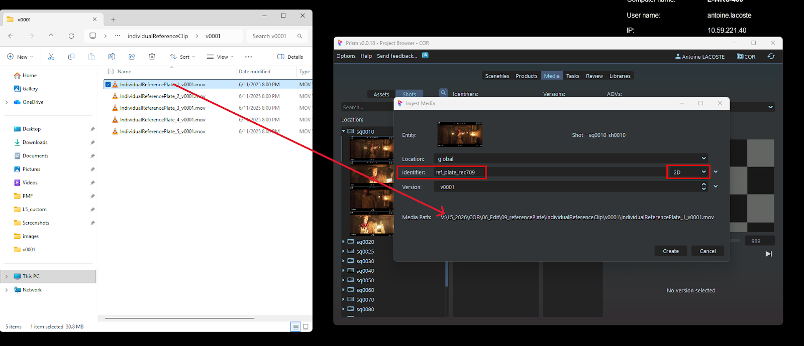

Then click **Create**.

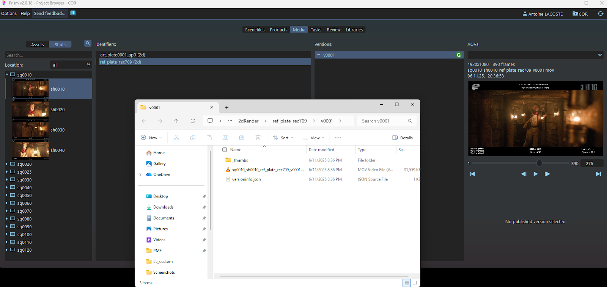

The plate is now correctly ingested in the Prism pipeline and can be **published to ShotGrid**, inside the **Department → ref**.  

You may delete all the **individual reference .mov files** to save storage.
**Do NOT delete the v0001 folder** - it must remain as a record, in case a `v0002` is ever needed.

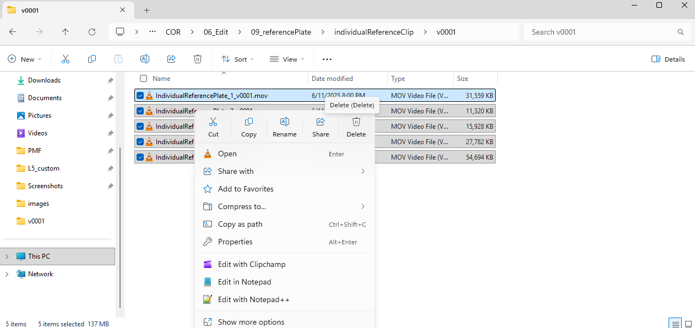